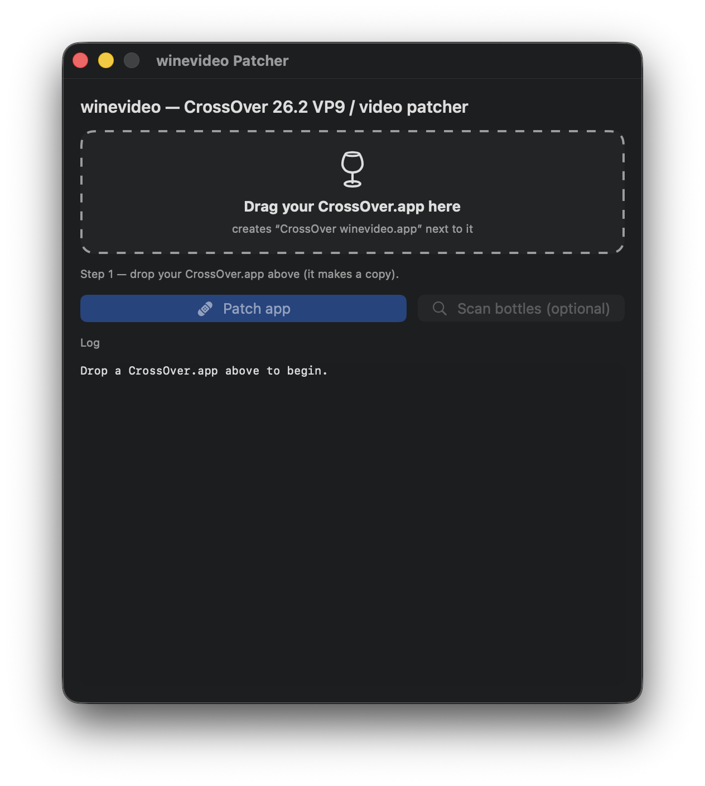
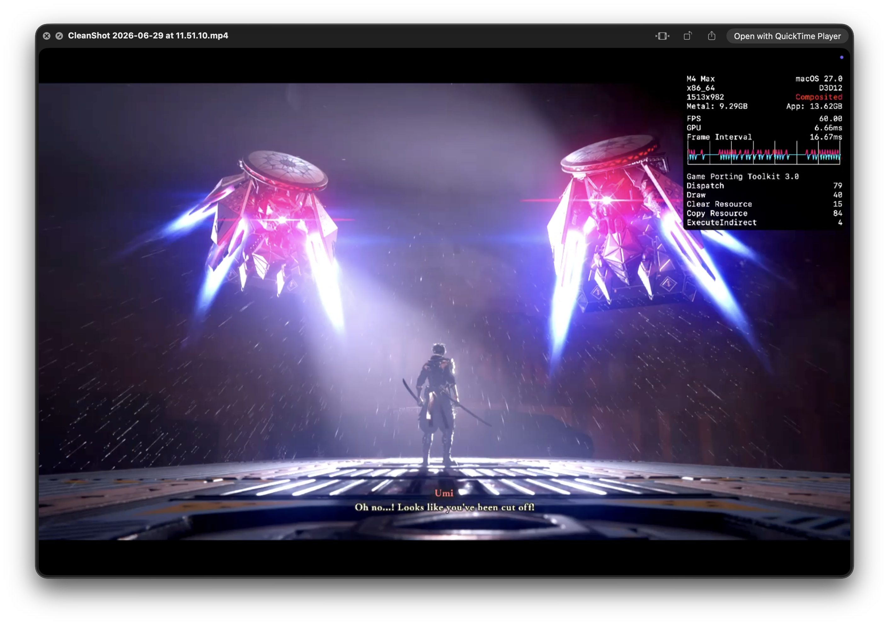

# winevideo

Drop-in **VP9 / WebM video support for CrossOver 26.2** on Apple Silicon, plus a fix
for the d3dmetal crash that kills Media Foundation video playback.

Stock CrossOver 26.2 cannot decode VP9 and ships no WebM/Matroska support, so games
that play VP9 cutscenes through Windows **Media Foundation** either refuse to start
("the codec needed to play VP9 format videos is not installed") or hard-crash when a
frame reaches the GPU. winevideo patches a copy of CrossOver to fix both.

Reference test title: **Ninja Gaiden 4** (VP9-in-WebM cutscenes) — boots to gameplay
with cutscenes playing.

## Screenshots

The drag-and-drop patcher, and a VP9 cutscene playing in Ninja Gaiden 4 under
CrossOver 26.2 on the d3dmetal backend:

<p align="center">
  
  &nbsp;&nbsp;
  
</p>

## What it does

1. **Adds a real VP9/VP8 decoder** to CrossOver's GStreamer-backed Media Foundation
   pipeline (`libgstvpx`) plus WebM/Matroska demuxing (`libgstmatroska`), built against
   the matching GStreamer 1.24 runtime.
2. **Advertises VP9 to games.** Registers a real winegstreamer-backed VP9 decoder MFT so
   `MFTEnumEx(MFT_CATEGORY_VIDEO_DECODER, VP90)` returns it — games gate playback on this
   check and otherwise show "VP9 codec not installed."
3. **Fixes the d3dmetal video crash.** On the d3dmetal backend, the D3D11 path cannot
   create NV12 textures (`CheckFormatSupport(NV12)=0`); Media Foundation creates one
   anyway and Apple's Metal validation aborts the process (`invalid pixelFormat (0)`).
   A patched `mfplat` falls back to a supported format (BGRA) instead of crashing. This
   is codec-independent (it also affected H.264 video).

See [docs/ARCHITECTURE.md](docs/ARCHITECTURE.md) for the full technical breakdown.

## Requirements

- **CrossOver 26.2** (the stable release — **not** CrossOver Preview), Apple Silicon
  (macOS). The binaries are built against 26.2's Wine 11.0 / GStreamer 1.24.5 and are
  version-specific; the patcher refuses other builds.
- Use the **d3dmetal** graphics backend (the only one that runs most D3D12 titles).

## Install

Patch a **copy** of CrossOver — never the original.

### GUI

Open `gui/winevideo Patcher.app`:

1. Drag your `CrossOver.app` onto the window — it copies it to
   `~/Applications/CrossOver-winevideo.app` (a copy only — nothing is patched yet).
2. Click **Scan bottles** and tick the bottle you play your VP9 game (e.g. Ninja Gaiden 4)
   in. Games gate on the VP9 decoder MFT, which is registered *per bottle* — so the bottle
   you play in must be patched, not just the app.
3. Click **Patch**. This patches the app **and** the selected bottle(s) in one step — no
   password or special permissions required.
4. Launch `~/Applications/CrossOver-winevideo.app` and run the game.

The app is unsigned; clear quarantine before first launch:
`xattr -cr "gui/winevideo Patcher.app"`.

### Command line

```sh
# duplicate first (Finder, or: ditto /Applications/CrossOver.app ~/Applications/CrossOver-winevideo.app)
patcher/patch.sh /path/to/CrossOver-copy.app [bottle ...]
```

- No bottle argument → patches the app and every existing bottle.
- The app-level DLLs apply to all bottles; the per-bottle registry must be applied to
  each bottle (re-run with a bottle name for bottles created later).

Revert with `patcher/restore.sh /path/to/CrossOver-copy.app [bottle ...]`.

## How a patched app is produced

The patcher copies prebuilt artifacts (`patcher/payload/`) into the app, ad-hoc signs the
added libraries, registers the VP9 decoder MFT and `.webm`/`.mkv`/`.msd` byte-stream
handlers in the bottle registry, then re-seals the bundle. To avoid needing an admin
password or Full Disk Access, it stages the copy as a plain **folder** (macOS App
Management only guards real `.app` bundles), patches and re-seals it there as the normal
user, then renames it to `.app`. The macOS-specific steps (copy with `ditto`, strip
quarantine, ad-hoc re-seal **without** `--deep` to preserve Wine's entitlements, and wait
for Wine's registry flush) are documented in [docs/ARCHITECTURE.md](docs/ARCHITECTURE.md).

## Repository layout

| Path | Contents |
|------|----------|
| `patcher/` | Self-contained patcher: `patch.sh`, `restore.sh`, and `payload/` (prebuilt DLLs/plugins/deps + registry) |
| `gui/` | SwiftUI front-end (`WineVideoPatcher.swift`) and `build-app.sh` |
| `build/` | Scripts and patches to rebuild the Wine DLLs from CrossOver 26.2 source |
| `build/patches/` | Wine source patches (VP9/AV1 caps, VP9 decoder MFT, mfplat BGRA fallback, build guards) |
| `docs/` | Architecture and technical notes |
| `mf_probe*.c`, `mft_probe.c` | Standalone test harnesses (decode probe, MFT-enumeration probe, D3D-backed probes) |

## Building from source

The payload is prebuilt, so rebuilding is only needed to modify the Wine DLLs. See
[build/README.md](build/README.md). The Wine source patches are in `build/patches/`.

## Scope and limitations

- Covers games that play video through **Windows Media Foundation** (`IMFSourceReader`),
  the common path for non-Unreal titles.
- **Unreal Engine titles using ElectraPlayer** (UE's own video stack) are **not** covered
  — Electra decodes independently of Media Foundation. Workaround: disable the game's
  startup/cutscene movies.
- The d3dmetal NV12→BGRA fallback may render some cutscenes with incorrect colors: it
  prioritizes crash-free playback over color accuracy. A complete fix for NV12 video
  textures belongs in the D3D11→Metal backend itself.

## Licensing

The patcher's own scripts and harnesses in this repository are provided as-is. The
prebuilt payload consists of Wine DLLs rebuilt from Wine source and GStreamer plugins +
their dependencies, all derived from LGPL projects (Wine, GStreamer, libvpx, etc.).
winevideo patches an existing, separately-licensed **CrossOver 26.2** install — you must
supply your own.

## Disclaimer

This is an unofficial, community modification of CrossOver. It is provided **as-is, with
no warranty of any kind**, and you use it **entirely at your own risk**. The authors are
not liable for any damage, data loss, or broken installs resulting from its use. Always
patch a *separate copy* of CrossOver and keep your original install untouched.

- **Support is best-effort.** This is a hobby project shared as-is, so there's no
  guarantee of support, fixes, or updates. Feel free to open an issue — just know that
  replies may be slow or may not come.
- **No CodeWeavers support for a patched CrossOver.** CodeWeavers supports CrossOver only
  in its original, unmodified form. Do **not** contact CodeWeavers or use their support
  channels for problems with a patched copy, and do not report bugs to them that occur on a
  patched install. If you want official support, run a stock, unpatched CrossOver.
- **License compliance is your responsibility.** Modifying CrossOver may fall outside the
  terms of your CrossOver license. Ensuring your use complies with CodeWeavers' license
  terms is up to you.
- **Not affiliated.** winevideo is not affiliated with, authorized by, or endorsed by
  CodeWeavers, Apple, or any game publisher. "CrossOver" is a trademark of CodeWeavers;
  all other names and trademarks are the property of their respective owners.

## AI disclosure

This project — its code, scripts, and documentation — is **fully AI-generated**,
human-steered, and human-tested. Review the changes before running them.
